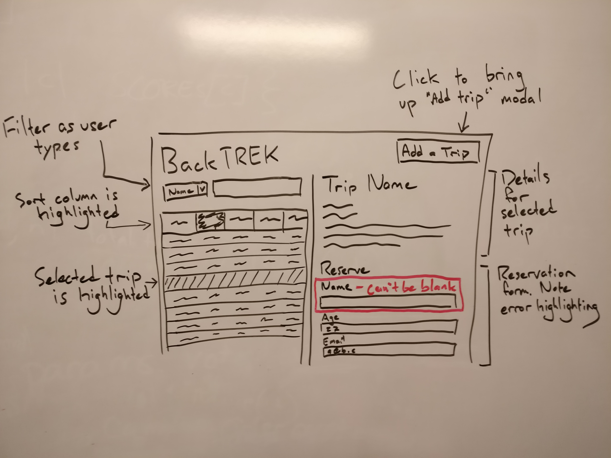

# BackTREK

## Introduction

For this project we'll be returning to the TREK API, using Backbone to build an application that can handle data in complex ways.

This is an individual, [stage 2](https://github.com/Ada-Developers-Academy/pedagogy/blob/master/rule-of-three.md#stage-2) project.

We'll be reusing the [TREK travel API](https://trektravel.herokuapp.com/trips), [documented here](https://github.com/AdaGold/trip_api). The core purpose of the website will be the same, but we'll use Backbone to better organize our code and to provide all sorts of extra functionality.

You can see a live version of the site implementing the optional wireframes below at https://backtrek.herokuapp.com/

## Learning Goals

- Generate HTML using Underscore templates
- Use Backbone and jQuery to work with a complex API
- Manage application data using Backbone models and collections
- Build an attractive, robust, and feature-rich user interface

## General Requirements

The code you write should obey the following rules:

- Use Backbone's event workflow. Code that responds to DOM events should be separate from code that updates the DOM.
- Any dynamic elements on the page shall be rendered using Underscore templates
- Any errors encountered while interacting with the API shall be politely reported to the user

This project has 3 waves, arranged more-or-less in order of difficulty. It's worthwhile to read through all three before you start, and come up with a plan for how to organize your code. However, make sure to pace yourself, and only try to solve one problem at a time.

## Wave 1: Displaying Data

In wave 1, you'll use our new functionality (Underscore templates, Backbone models and collections) to achieve feature parity with the original TREK project.

- A user can click a link to see a list of trips
- A user can click on a trip to see details of that trip

## Wave 2: Creating Data

In wave 2, your focus should be on sending data to the server and handling the response.

- A user can create a new trip
- A user can reserve a spot on a trip
  - Question: is Backbone API integration useful here? How would this work? What other options are there?

Pay careful attention to error handling! The TREK API now includes server-side validation - what happens when these fail? How will you let the user know what happened?

Your app should also include client-side validation, to preemptively catch as many errors as possible and give the user quick feedback. Feel free to inspect the server-side validation code for [reservations](https://github.com/AdaGold/trip_api/blob/master/app/models/trip.rb) and [new trips](https://github.com/AdaGold/trip_api/blob/master/app/models/trip_reservation.rb), if it will help you.

## Wave 3: Organizing Data

### Sorting

Users should be able to sort the list of trips by:

- Name
- Category
- Continent
- Weeks
- Cost

The user should be given some sort of visual feedback that the data has been sorted, even if the order didn't change.

### Filtering

Add a form to the top of your trip list. The form should have a dropdown to select `Name`, `Category`, `Continent`, `Cost` or `Weeks`, as well as a text box.

When the user types in the text box, the list of trips will be filtered to only show trips that match.
- For a text field (`Name`, `Category`, `Continent`), the trip's value for that field should _include_ the filter value.
  - Filtering for `Continent` `asia` should match both `Asia` and `Australasia`
- For a numeric field (`Weeks`, `Cost`), the trip's value for that field should be _less than or equal to_ the filter value.

The list of displayed trips should be updated with every keystroke. This means that making a new query against the API every time will be too slow. Instead, you should filter your list in JavaScript, probably via a custom method on the collection.

Your app should gracefully handle the case where none of the trips match the filter.

This feature is complex - it's what brings this project from stage 1 to stage 2. Spend some time thinking it through before you start writing code. What data needs to be where, how will code be organized, and how are you going to avoid stepping on your own feet?

## Optional Wireframes

These wireframes are optional. Some of the content matches closely with what we've done before, but some (such as getting validation failures to appear inline) is quite challenging!

For an extra challenge, if user input is blocked by client-side validations, have the errors resolve themselves as the user types.

#### Normal View

#### Add-Trip Modal

Foundation includes modal functionality, but it can be tricky to get it to work right. Instead, [roll your own](https://www.w3schools.com/howto/howto_css_modals.asp)!

